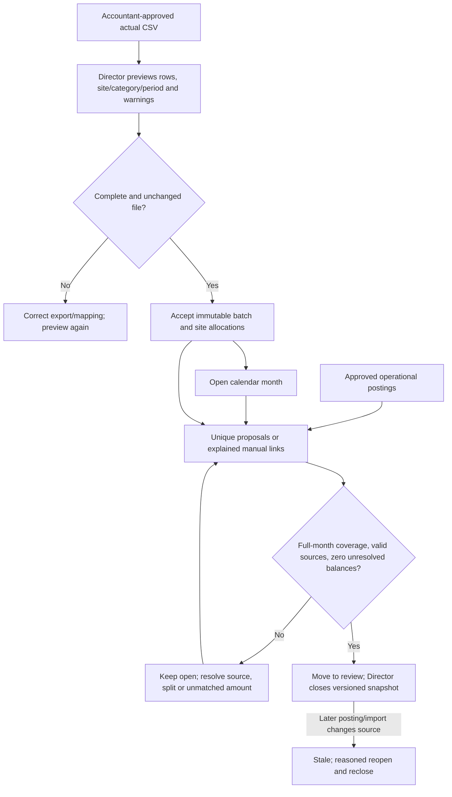

# Accounting CSV, reconciliation and period close

**Who uses it:** Director previews/accepts accounting files and controls organization-wide calendar-month reconciliation and close; a granted Area Manager sees assigned-site aggregate status. **Screens:** `/finance` (Accounting CSV section) and `/finance/reconciliation`. The implemented intake is a neutral **manual CSV**, not a live Sage connection.

## Import procedure

1. Obtain the supported neutral CSV from the accounting owner. Check source IDs, service period, actual/approved state, currency, category, amount, site and optional project/document reference before upload. Use a complete calendar month when seeking a close.
2. On `/finance`, select **Accounting CSV**, choose the file and **preview**. The server parses and maps rows without writing a batch. Resolve unknown sites, categories, malformed amounts, duplicate IDs, estimated/pending rows and unallocated amounts with the accounting owner. Do not call a partial file complete.
3. A Director accepts the **unchanged** file and mapping. The app stores an immutable batch, source rows and allocations, keyed by file hash and mapping version. Verify the accepted batch and source totals. A corrected export supersedes the old batch; it does not erase its audit history.

## Match and close procedure

1. Open `/finance/reconciliation`, choose **Open or view period** for the correct organization calendar month, and inspect site coverage, accepted batches, operational amount, matched amount, unmatched amount, unallocated accounting and ambiguity/invalid counts.
2. Run deterministic matching. Apply only unique supported proposals. Ambiguous or reciprocal candidates require human source inspection. When needed, enter an explained manual amount/split that fits the remaining balances and matches organization, site, project, category, currency and period.
3. A match links an **existing** operational posting to an **existing** accepted accounting allocation. It consumes remaining balances but creates no expense. If wrong, void the active link with a reason while the period is not closed; then correct and match again.
4. Move the period to **review** only when ready. **Close balanced period** is Director-only and recomputes full-month accepted coverage and all control balances in the database. A zero visible unmatched amount is insufficient if coverage or source validity is incomplete.
5. A later accepted import or changed operational amount can make a closed snapshot **stale**. A Director reopens with a reason, reviews/voids/relinks as necessary and closes a new version. Historical close and link events remain auditable.

## Read the results correctly

| Value | Meaning |
| --- | --- |
| Expected contract/project revenue | Projection from active approved terms; not an accounting actual. |
| Invoiced | Customer invoice recorded in a project; not collected cash or recognized revenue. |
| Recognized revenue/direct costs | Accepted approved actual accounting allocations for the selected period/site. |
| Operational posting | Approved CleanOps source cost; linked to accounting later, not added a second time to accepted accounting totals. |
| Direct contribution | Recognized revenue less accepted direct costs when the period is complete, closed and current. Not net profit. |
| N/A or stale | Missing full coverage, invalid/unresolved sources, missing close or a post-close change. Never treat as zero. |

The import path is [finance actions](../../src/app/finance/actions.ts) → [CSV validation](../../src/services/finance-csv.ts) → `stage_finance_csv_import`/`accept_finance_import`. The close path is [reconciliation actions](../../src/app/finance/reconciliation/actions.ts) → [workspace](../../src/integrations/finance/supabase-reconciliation.ts) and database reconciliation/period RPCs. See [technical flow](../PROCESS_FLOWS.md#20-accounting-match-and-period-close-clean-038) and [Gate A process](../demo/GATE_A_FINANCE_PROCESS_FLOWS.md#10-deterministic-matching-manual-split-and-period-close).

**Training check:** show an incomplete import that cannot close; then, in synthetic UAT, match one unique pair, explain an ambiguous pair, close a complete balanced month, and show why a later source makes it stale.
