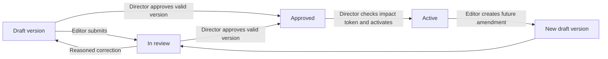

# Contracts: draft, source review and activation

**Who uses it:** a Director or assigned-site Area Manager creates/edits a draft; an Operations Manager can inspect operational terms without commercial values; only a Director approves and activates. **Screen:** `/finance/contracts` → **Add contract** → `/finance/contracts/new` → contract review.

## What the states mean

Activation generates future service tasks/schedules, staffing coverage requirements, SLA definitions and **expected** revenue. It does not accept an invoice, receive cash or make recognized accounting revenue. Historical task runs and earlier expectations retain their version provenance after an amendment.

## Operator procedure

1. In **Contract register**, verify the casino and whether an active contract/version already exists. A new customer contract needs a source document and an agreed effective date. Select **Add contract**, enter code and name, and save the draft.
2. Work through the saved sections: identity/dates; billing model, amount and currency; weekday staffing and positions; recurring and specialist obligations with a **same-site zone**; SLA numerator, denominator and exclusions; and supplies/equipment responsibility. Save each section before moving on. Reload the draft to confirm the values persisted. Unsupported or unknown source terms should remain unresolved, not guessed.
3. If using a PDF, DOCX or image, open the draft review and stage the document. The browser uploads to private storage under a scoped ticket; finalization verifies actual bytes, MIME, size and hash. Run extraction, then compare each proposed value and cited text span to the source. Record **accept, edit, reject or unknown** for each material proposal. Extraction is a suggestion; it never approves or activates.
4. Resolve every required obligation zone and matched material proposal. **Submit for review** when the draft is ready. If it needs correction, an authorized editor uses **Return to draft for revision** with a reason, fixes the same version and resubmits. The review screen exposes an audit trail.
5. A Director verifies dates, priced terms, staffing, obligations, responsibility and source decisions, then **approves this version**. Inspect the **Activation impact preview** counts and the currently displayed amount/date window. The Director activates using that approved version's current token; a changed approved version must be previewed again.
6. Reload the contract, then inspect generated service tasks, schedules, coverage, SLA definitions and contract revenue expectations. For an amendment, create a **future amendment draft** from the active contract and repeat review/approval/activation. Do not edit historical active expectations to simulate an amendment.

## When to stop

| Screen condition | Operator response |
| --- | --- |
| Contract or source is restricted | Check active membership and assigned site; do not forward a private source file outside the app. |
| Material proposal has no human decision | Review the cited source or mark unknown; submission stays blocked. |
| Zone is unresolved or priced term/dates invalid | Correct the draft and reload before Director approval. |
| Review disagrees with the source | Return to draft with a reason; retain both source and review history. |
| Activation impact is unexpected | Do not activate. Resolve the contract terms and generate a fresh preview. |

## Evidence and implementation map

| User-visible result | Implemented source/write |
| --- | --- |
| Register and review | `contracts`, `contract_versions`, staffing/obligation/SLA/financial child rows through [contract pages](../../src/app/finance/contracts/page.tsx) and [review page](../../src/app/finance/contracts/[id]/review/page.tsx). |
| Draft step, zone, submit, return, approval and activation | [Contract actions](../../src/app/finance/contracts/actions.ts) call scoped RPCs; `contract_events` records transitions. |
| Private document and extracted proposals | [Document actions](../../src/app/finance/contracts/document-actions.ts), private `contract_documents`, extraction runs/proposals and human decisions. |
| Generated operations and expected revenue | `preview_contract_activation` / `activate_contract_version`; `contract_revenue_expectations` is separate from accepted accounting allocations. |

See [Data mapping](../DATA_MAPPING.md#financecontracts--manual-contract-setup-and-review) and [Gate A contract process](../demo/GATE_A_FINANCE_PROCESS_FLOWS.md#3-manual-contract-draft-and-canonical-version). The screenshots in Gate A are seed-specific historical teaching aids; read the live version and impact values before a customer decision.
