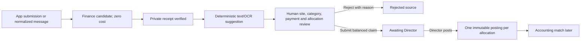

# Expense intake, receipt review and posting

**Who uses it:** an assigned user submits through `/mobile/expenses`; a Director or granted Area Manager reviews `/finance/inbox`; only a Director posts from `/finance/expenses`. A normalized message may create a candidate where configured, but official customer WhatsApp/group transport is a separate provider gate.

## Operator procedure

1. The submitter chooses an authorized casino, writes the original expense explanation and attaches a receipt where required. Check that the submission appears as a **candidate**. A candidate and uploaded file do not yet affect cost or reimbursement.
2. In **Finance Inbox**, open the candidate and original text. Open the private receipt only through its authorized link. A ready document has passed server-side byte/type/size/hash verification; a staged, failed, missing or quarantined document is not ready for posting.
3. Run the available suggestion if helpful. It can suggest vendor, date, amount, tax, category and payment details. Compare every suggestion against the receipt and policy. Record unknown values explicitly; machine output cannot decide a site, payment or posting.
4. As Director or assigned Area Manager, resolve site, category, date, vendor, payment method, claim total and allocations. Link a permitted project or asset only when supported by the source. Confirm the allocations balance to the claim. Reject an unsupported claim with a reason rather than assigning it a guessed value.
5. On **Expenses and approved direct cost**, a Director checks the source, receipt, review reason and allocations, then approves/posts. Reload to confirm **posted** status, one posting per allocation, approval actor and source drill-through. An Area Manager may review but cannot post.
6. Later, link the approved operational posting to an accepted accounting allocation in [reconciliation](ACCOUNTING_AND_CLOSE.md). A link does not add another direct cost. Record employee reimbursement separately; `employee_paid` does not prove payment.

## Guardrails and exceptions

| Situation | Correct interpretation/action |
| --- | --- |
| Exact receipt bytes appear under another source | Organization receipt-hash guard blocks a second posted cost. Investigate; do not re-upload to bypass it. |
| Missing payment method, wrong site or unbalanced allocation | Keep in review until a human resolves the field or rejects with reason. |
| Equipment purchase | Marked for asset/accounting review; CleanOps does not decide capitalization, and this category is excluded from ordinary direct expense contribution pending treatment. |
| Expense appears in a project and site overview | It is the same posting with a project link, not two expenses. |
| WhatsApp candidate exists | This demonstrates normalized source handling, not automatic permission to ingest a customer's existing groups. |

The supported private receipt path is implemented in [submission](../../src/components/expense-submission.tsx), [upload ticket](../../src/services/expense-upload-ticket.ts), [Finance Inbox](../../src/components/expense-inbox.tsx) and [expense actions](../../src/app/finance/expenses/actions.ts). The core rows are `finance_intake_items`, `finance_intake_documents`, `expense_claims`, `expense_allocations`, `expense_postings` and expense audit records. Posting is an idempotent Director-authorized RPC. See [Data mapping](../DATA_MAPPING.md#mobileexpenses-financeinbox-and-financeexpenses).

**Training check:** with synthetic data, ask the reviewer to show the original source, document state, a corrected human field, site allocation, posting actor and accounting-match status. A pending candidate must have no recognized operational cost.
