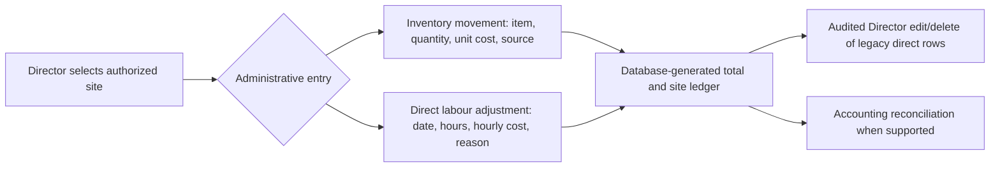

# Supplier catalogue, direct ledgers and message context

**Screen:** `/finance`, below the manager summary and accounting CSV. These are additional implemented controls, distinct from the standard [approved-time](TIME_AND_RATES.md), [expense](EXPENSES.md) and [supply request](SUPPLIES_AND_EQUIPMENT.md) workflows. A Director can edit the direct finance ledgers; an Area Manager has permitted inventory/aggregate reads and can confirm message context for an assigned site.

## Supplier and item catalogue

1. A Director chooses the authorized casino/organization context and adds an organization supplier and inventory item. Use a source-backed name, SKU, unit and active status. The catalogue is shared within the organization, not invented per site.
2. Verify the new entries in the form choices before recording a stock movement or site request. Area and Operations Managers may view the permitted catalogue, but only Directors write it. Supervisors use a site-scoped item list for requests, not the full supplier table.

## Direct inventory and labour adjustments

1. In the inventory ledger form, choose item, transaction type, quantity, unit cost, site and source note. The database calculates `round(quantity × unit_cost, 2)`; the browser does not set the total. Distinguish receipt, issue, count and adjustment from an approved supply request's append-only workflow movement.
2. In **Direct labour cost adjustment**, enter worker/task context where appropriate, site, work date, hours, hourly cost, class and source reason. The database calculates `round(hours × hourly_cost, 2)`. This is an administrative adjustment/import reference; normal attendance-derived cost uses [time review and effective rates](TIME_AND_RATES.md). A Director must not use it to bypass a missing approval.
3. Reload and inspect the ledger. Director edits/deletes of legacy direct entries create `finance_ledger_audit_events` with before/after values. Organization, site and ID cannot be reassigned. Workflow stock movements and time-linked posted labour are immutable through these direct forms.
4. A granted Area Manager may read assigned-site inventory ledger and accepted aggregate labour, but **not** individual labour cost entries or rates.

**Known input defect:** the direct labour adjustment Hours input currently has `min="0.01" step="0.25"`; native validation can reject ordinary whole hours. Do not work around it by entering a false amount. The [issue audit](../plans/ISSUE_REVALIDATION_2026-09-28.md#recommended-next-bounded-finance-work) recommends a focused fix.

## Normalized message context queue

1. On the selected site's queue, a Director or granted Area Manager opens the original normalized source message, sender and any linked media. The text and any automated suggestion are untrusted.
2. Confirm supported site, zone, task, worker and sender role only where the source and identity mapping justify them. The site and actor are checked server-side; the confirmation writes `external_message_contexts` with manual resolution provenance.
3. Reload to verify confirmed status. **Context confirmation is not expense review, financial posting, attendance, quality approval or proof of live WhatsApp group access.** Route a finance candidate through [expense review](EXPENSES.md) separately.

The [workspace](../../src/components/finance-workspace.tsx) calls [finance actions](../../src/app/finance/actions.ts). Catalogue and direct ledgers use `vendors`, `inventory_items`, `inventory_transactions`, `labor_cost_entries` and `finance_ledger_audit_events`; message context uses a site-authorized RPC and `external_message_contexts`. See [data mapping](../DATA_MAPPING.md#finance--supplier-inventory-labour), [message mapping](../DATA_MAPPING.md#finance--whatsapp-context-queue) and [technical process](../PROCESS_FLOWS.md#11-finance--supplier-and-inventory).

**Training check:** add a synthetic supplier/item, record a direct entry and show its database total/audit. Then confirm one message's operational context and explain why neither action alone approves an expense.
