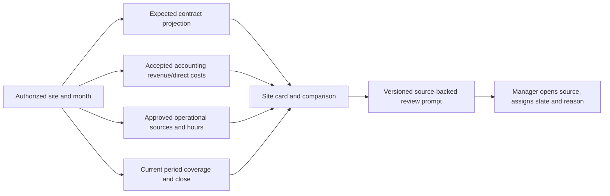

# Finance overview, site comparison and review prompts

**Who uses it:** Director across the organization; Area Manager only at granted sites. **Screen:** `/finance`. Other roles do not receive internal finance totals. The overview is a read and review surface; changing a prompt does not change its source record.

## Manager procedure

1. Verify your role, selected month and casino. Without a month parameter, the page chooses the latest complete, current closed month visible to the account when available, otherwise the current month. **All assigned casinos** compares only permitted sites; selecting a casino never grants another site.
2. Read **Expected contract revenue** as a projection and **Recognized revenue** as accepted accounting actual. Review direct labour, supplies, repairs and other direct costs from the accounting-side period, then read **Direct contribution** and margin only if the period is complete, closed and current. Direct contribution is not net profit.
3. Read approved operational labour, hours and expense categories as **source indicators**. They are displayed separately from accepted accounting amounts. Do not add operational postings to accepted accounting costs a second time.
4. For all-site comparison, check **Complete sites**. The combined contribution remains **N/A** if any selected site is incomplete or currencies cannot be combined. A separately labelled covered-site subtotal may still help analysis; it is not an all-site result. Supply expense per approved hour is N/A without a positive approved-hour denominator.
5. Open each **Review prompt** source link. The prompt states its rule, period, observed value, baseline and sample count. Decide whether it needs investigation. Choose open/snoozed/resolved and record the reason or next step where required, then reload the review history. A prompt is a cue for human review, not a finding of misconduct or an automatic correction.

## What not to infer

| Display | Correct reading |
| --- | --- |
| N/A contribution or stale close | Coverage or current close is missing; not a zero-margin site. |
| Pending supply request count | Requests created in the selected month still pending or partially received; not purchases. |
| Repair count/cost | Linked approved repair sources; repeated work is not a cause attribution. |
| Staffing coverage or notice acknowledgement N/A | Period-scoped sources are not yet connected to this finance view. No green status is inferred. |
| Resolved review prompt | Manager reviewed the prompt; the underlying contract, expense, asset or period is unchanged unless separately edited in its owning workflow. |

The [summary component](../../src/components/finance-summary.tsx) calls [summary service](../../src/services/finance-summary.ts) and [authenticated integration](../../src/integrations/finance/supabase-finance-summary.ts). [Review action](../../src/app/finance/summary-actions.ts) recomputes the still-active prompt and writes `finance_exception_reviews` with append-only history. Source rules are versioned and synthetic thresholds still need manager calibration. See [data mapping](../DATA_MAPPING.md#manager-overview-and-explained-prompts-clean-021) and [technical flow](../PROCESS_FLOWS.md#clean-021-manager-overview-and-exception-review).

**Training check:** compare one complete and one incomplete site, explain the covered-site subtotal versus all-site N/A, open a prompt's source, save a review reason and show that the source value did not change.
