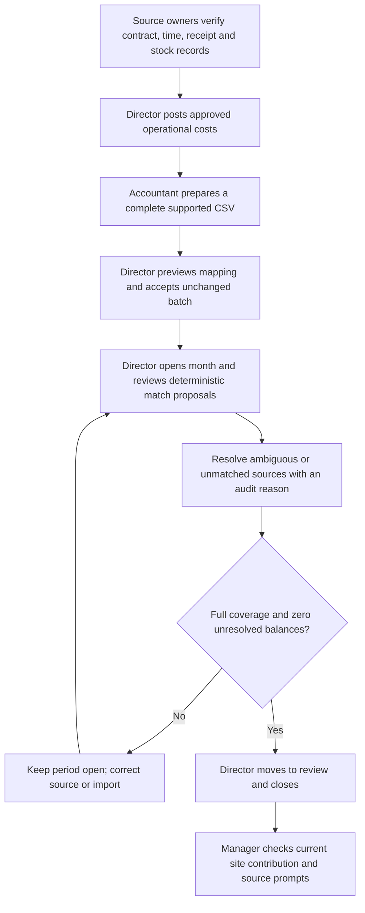

# New customer finance setup and first-period runbook

**Audience:** customer sponsor, CleanOps implementation lead, Director, site managers and accounting owner. **Status:** operator-assisted process for the implemented finance MVP. CleanOps has no self-service customer signup, bulk tenant importer, live Sage connector or payroll connector. The synthetic demo provisioning/reset scripts are **not** customer onboarding tools.

## 1. Agree the operating boundary before loading data

| Decision and owner | Record before configuration | Why it matters |
| --- | --- | --- |
| Customer sponsor | Legal organization, sites, named operational and finance owners, intended pilot scope | Each user and source belongs to one organization and permitted sites. |
| Director + accountant | Accounting system/export owner, supported CSV mapping, reporting currency, first complete calendar month, correction/supersession rule | Accepted accounting rows provide recognized actuals; CleanOps does not replace the ledger. |
| Contract owner | Signed source version, effective dates, site and zone map, pricing, staffing, tasks, SLA/exclusions and responsibility clauses | Activation creates future work and expected revenue; unknown terms should remain unresolved. |
| Operations owner | Worker identity mapping, site permissions, shift attendance practice, rate owner, receipt and repair approval policy | Messages and attendance do not authorize financial posting. |
| Privacy/security owner | Access grants, document retention, private media handling, provider approval, recovery and support contacts | Customer documents and rates must remain role/site scoped. |

If a customer needs a live WhatsApp group, automatic Sage sync, payroll approval, multiple active organizations per user or a full production pilot, stop at the relevant [open gate](../plans/ROADMAP.md#outstanding-issue-and-release-gates). Do not substitute demo credentials or generated fixtures.

## 2. Provision and verify the tenant (implementation operator)

1. Provision the customer organization, clients, sites, zones and active user memberships through an **approved, audited administrative process outside the current self-service UI**. Assign site grants for Area Managers, Supervisors, Cleaners and Client viewers. Directors and Operations Managers have organization-wide site lists in the current access context. Do not use the `finance-showcase` or general-demo organization.
2. Establish worker records and active site permissions before deriving time or assigning tasks. Configure the private document/evidence storage and application environment using the deployment runbook. Keep service credentials server-side.
3. Sign in separately as a Director, one assigned-site Area Manager, one Supervisor and one Client. Verify each permitted page and a denied site/role path. With zero or multiple active memberships, the app must stop rather than infer a tenant.
4. Record the migration/deployment revision, organization/site IDs in the protected implementation log, and who approved access. The repository does not contain a customer-tenant creation wizard or a customer-ready data-migration command.

**Exit:** role and site isolation is demonstrated with customer-approved test records; no finance documents are uploaded until access is correct. Technical access rules: [Security](../SECURITY.md), [Data mapping](../DATA_MAPPING.md#login).

## 3. Configure the operational and commercial baseline

1. Agree site-local dates, time zone, zones and contract source authority. In [Contracts](CONTRACTS.md), create one site contract draft, save each section, resolve the obligation zone, verify any private document extraction and obtain Director approval. Inspect the activation impact preview before activating. Expected revenue is a projection only.
2. In [Time and rates](TIME_AND_RATES.md), a Director records effective worker cost rates for the permitted site and dates. Use synthetic worker/test periods first; a rate must exist on the site-local work date before approved time can post.
3. In [Supplies and equipment](SUPPLIES_AND_EQUIPMENT.md), a Director creates the organization supplier/item catalogue; site operations establish actual stock and approved equipment checklists. A request, order or inspection is not an invoice or direct cost.
4. Agree which expense categories, receipt fields, payment methods and approval reasons customer staff will use. Train reviewers with [Expense intake and approval](EXPENSES.md). Equipment purchases require asset/accounting review and are excluded from ordinary direct expense contribution pending treatment.

**Exit:** a Director can open the site contract, see the generated obligations and projected revenue, inspect an effective rate and trace one test request/receipt without a double-counted cost.

## 4. Run a controlled first finance period

1. Start with one site and **one complete calendar month**. The accountant owns source IDs, actual/approved status, service period, site, category, currency and corrections. See [Accounting and period close](ACCOUNTING_AND_CLOSE.md).
2. Review operational time and receipt exceptions before posting. If a record is unknown, duplicate or outside the correct site/period, keep it pending and document why.
3. Preview the CSV before acceptance. Incomplete, estimated, pending and unallocated rows are visible but cannot support a complete recognized month. The Director accepts the unchanged file and verifies batch history.
4. Link posted operational costs to accepted allocations. Use automatic proposals only where unique. Manually split or correct with a reason where needed. Links identify the same cost across sources; they do not create a new expense.
5. Close only after the database shows complete accepted coverage and balanced controls. A later import/posting can mark the snapshot stale; reopen with a reason and reclose after review. Train managers to expect N/A while incomplete.

**Exit:** Director and Area Manager independently explain the same site/period using source links, with rates and raw import restricted from the Area Manager. The customer accountant signs off the source-to-source reconciliation; CleanOps does not certify accounting policy.

## 5. Pilot and handover

Document a named owner for contract amendments, expense exceptions, rate changes, CSV supersession, stale closes, access revocation and support. Rehearse failure/retry and a second period. Validate backups/restore, monitoring, retention and provider terms before a production pilot. Gate A synthetic proof and the remaining [pilot issue #38](https://github.com/niru2015/cleanops-ai/issues/38) are separate evidence.

Training practice: give each role a synthetic source and ask them to locate it, make only their authorized decision, reload, and explain what remains pending. A Client should see only a deliberately released redacted service report. Never use customer records in the demo scenario factory.
