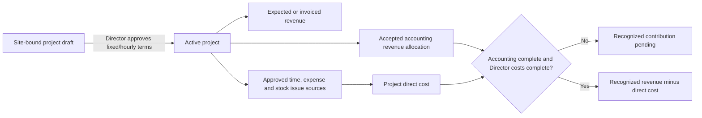

# One-off projects and direct contribution

**Who uses it:** Director or granted Area Manager can create and scope a site-bound draft; Director approves commercial terms, invoices, billable hours, cost close and cancellation. **Screen:** `/finance/projects`.

## Operator procedure

1. Select the casino and create a **one-off project** with a unique code, name, scope, dates and optional same-site parent contract. Reload the draft before adding sources.
2. A Director chooses a fixed quote or hourly billing rate, verifies the customer-approved amount and selects **Approve terms and activate**. This creates expected commercial terms, not accepted accounting revenue.
3. Review actual operational work. Approved project time can generate a labour snapshot; approved expense postings and inventory issues may be linked as existing sources. Link a source by type and record ID only after checking its site, project, category and original approval. A link does not rewrite the source or double-add a site cost. Non-time source linking is Director-controlled.
4. Record a customer invoice reference/amount if issued. **Invoiced** is displayed separately from **accounting recognized** and cash collection. Approved billable hours are a Director action for hourly projects.
5. Accept actual accounting revenue through the CSV workflow, then inspect recognized, unresolved and incomplete source counts on the project. A Director uses **Mark costs complete** only after cost review. If more cost appears, use the available reopen control.
6. Compare **expected revenue**, **invoiced**, **accounting recognized**, **direct cost**, **expected contribution** and **recognized contribution**. A final recognized contribution/margin remains pending until the accounting source and Director cost close are complete. Site totals already include the linked sources; never add the project subtotal to them again.

## Examples of pending states

- A quote exists but no accepted accounting revenue: expected revenue may display, recognized contribution remains pending.
- An invoice is recorded but its accounting allocation is absent or incomplete: invoiced is visible, recognized remains separate.
- An equipment purchase is awaiting asset treatment: do not count it as ordinary project direct expense.
- A source belongs to another site or has already been linked incompatibly: resolve the source rather than creating a duplicate posting.

[Project actions](../../src/app/finance/projects/actions.ts) use site and role checks before the project RPCs. The [workspace](../../src/components/project-workspace.tsx) reads project summaries and source links. `projects`, commercial terms/invoices, `project_source_links`, approved time/expense/inventory postings and `finance_source_allocations` provide the state. See [technical flow](../PROCESS_FLOWS.md#clean-037-one-off-project-contribution) and [Gate A process](../demo/GATE_A_FINANCE_PROCESS_FLOWS.md#8-one-off-project-terms-source-links-and-contribution).

**Training check:** explain why an active project with a quote and invoice can still show pending recognized contribution, then trace one approved labour cost and one accepted revenue allocation back to their original sources.
