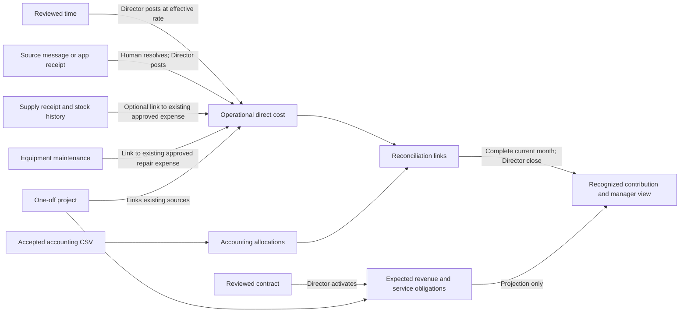

# Finance operator and customer training

**Implementation baseline:** `main` at `7d16984` (2026-09-28). This is a guide to the implemented application, not a promise of a live Sage, WhatsApp-group, payroll or banking connection. The Gate A screenshots use an older synthetic run; use them to learn the concepts, then check the current screen and source records before quoting figures.

CleanOps links approved operational facts to accepted accounting data. Accounting remains the financial source of truth. A quote, contract expectation, message, receipt, supply order or attendance event is **not** recognized revenue or a posted direct cost by itself. “Direct contribution” is recognized revenue less accepted direct costs; it excludes overhead, depreciation and tax and is not net profit.

## Start here

| If you are… | Read | Do in the application |
| --- | --- | --- |
| Setting up a new customer | [New customer setup](NEW_CUSTOMER_SETUP.md) | Establish access and source ownership, then test one site and one period before wider rollout. |
| Contract owner | [Contracts](CONTRACTS.md) | Draft, verify source, obtain Director approval and activate. |
| Expense reviewer | [Expense intake and approval](EXPENSES.md) | Verify source and receipt, resolve context, then route to Director posting. |
| Supervisor or finance time reviewer | [Time and rates](TIME_AND_RATES.md) | Resolve attendance exceptions; keep cost rates Director-only. |
| Project owner | [One-off projects](PROJECTS.md) | Approve commercial terms and link existing cost/revenue sources. |
| Supply or equipment owner | [Supplies and equipment](SUPPLIES_AND_EQUIPMENT.md) | Track requests, stock, inspections and repairs without counting one invoice twice. |
| Finance administrator or message reviewer | [Catalogue, direct ledgers and context](FINANCE_WORKSPACE.md) | Use legacy administrative entries and confirm source context without bypassing approval. |
| Accountant or Director | [Accounting and period close](ACCOUNTING_AND_CLOSE.md) | Preview and accept a CSV, match sources, close or reopen a period. |
| Manager | [Overview and review prompts](MANAGEMENT_OVERVIEW.md) | Compare sites only where source coverage is complete and inspect each prompt. |

The [Gate A finance training guide](../demo/GATE_A_FINANCE_TRAINING.md) is a **synthetic presenter script**; [Gate A process flows](../demo/GATE_A_FINANCE_PROCESS_FLOWS.md) record the tested synthetic state transitions. The technical [data mapping](../DATA_MAPPING.md), [dictionary](../DATA_DICTIONARY.md) and [process flows](../PROCESS_FLOWS.md) name the underlying pages, tables and RPCs.

## How the functions fit together

An operational source may appear in several drill-downs. A project link, stock movement or repair link does not create a second expense. The manager view shows expected and recognized revenue separately. Missing or stale accounting coverage produces **N/A**, not zero.

## Access and human decisions

| Role | Implemented finance responsibility |
| --- | --- |
| Director (`organization_administrator`) | All granted organization sites; commercial contract approval and activation, worker cost rates, expense and time cost posting, CSV acceptance, reconciliation and period close. |
| Area Manager | Assigned-site contract drafts and operational review, expense candidate resolution, project drafts, site aggregate finance and review prompts. No final commercial/financial posting, raw accounting import or individual worker rate/ledger. |
| Operations Manager | Organization-wide operational contract view, time and supply/equipment operations where allowed. No internal site margin, worker rate or finance import. |
| Site Supervisor | Assigned-site time review, supply and equipment operations and approved app submission surfaces. No finance contribution or cost-rate dashboard. |
| Cleaner | Assigned-site mobile evidence and expense submission where granted. No finance dashboard. |
| Client viewer | Released, redacted service report only. No internal finance, receipts or contract documents. |

The server derives organization and site access from an active membership; with multiple active memberships it fails closed pending an organization selector. A hidden tab is not an authorization boundary. See [Security](../SECURITY.md).

## Training rule for every workflow

Use a dedicated synthetic or approved UAT organization for practice. Before a write, confirm role, casino, period, source and whether the record already exists. After saving, reload the page and find the new state and source/audit link. Record a human reviewer and reason where the UI requires one. Do not use the hosted demo reset or generated data factory for a real customer organization.

For customer deployment, follow [new customer setup](NEW_CUSTOMER_SETUP.md) and the separate [pilot gate](https://github.com/niru2015/cleanops-ai/issues/38). A current UI and a green CI run alone do not establish provider readiness or customer acceptance.
