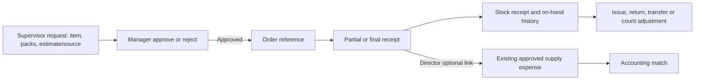
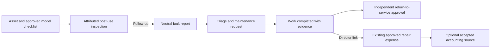

# Supplies, stock, equipment care and repair costs

These are operational workflows with finance links. **A request, order, stock issue, inspection or fault is not an invoice or posted expense.** One approved expense posting may be linked to a supply receipt or repair history and later to accounting; the link must not create a second cost.

## Supply request to stock history

**Screen:** `/supplies`, scoped to an assigned casino. Site Supervisors submit requests and may record assigned-site receipts/stock movements. Area/Operations Managers and Directors may approve/order as authorized; only a Director links an approved supply expense.

1. A Director sets up the organization supplier and inventory item in `/finance` before site requests. The requestor selects the site/item, purpose, pack quantity, base units per pack, estimated price per pack and price source/reference. Confirm the requested base quantity and estimated amount.
2. A manager reviews item, quantity, price source and purpose, then approves or rejects with a reason. Changing an approved item returns the request to **requested** and requires another approval. The manager records an order reference separately; approval is not a purchase.
3. A Supervisor records partial/final receipt against the approved item and remaining quantity. Reload the request to see requested, approved, ordered and received quantities. An idempotent receipt key prevents a duplicate stock receipt. Do not receive more than approved.
4. Use **Site stock** to record an opening balance, issue, return, transfer or count adjustment with source context. On-hand cannot go negative through a normal issue/transfer. A zero-difference count is still auditable. An uncertain legacy adjustment yields N/A until reviewed; a stock issue is not proof of consumption.
5. A Director may link the receipt to an **existing** approved same-site CAD supply expense posting. Use [expense review](EXPENSES.md) and [accounting reconciliation](ACCOUNTING_AND_CLOSE.md) for the cost and accounting source. The request/order/stock issue must not each become another expense.

The [supply workspace](../../src/components/supply-workspace.tsx) and [actions](../../src/app/supplies/actions.ts) use site-scoped RPCs. Records include `supply_requests`, request items/events, receipt/stock movement history and optional expense links. See [technical flow](../PROCESS_FLOWS.md#clean-017-supply-request-and-stock-workflow).

## Asset inspection, fault, maintenance and repair history

**Screen:** `/equipment` → asset code. Site operations can inspect/report/maintain at authorized sites. A Director approves source-backed checklist versions, repair-cost links and asset movements. Return to service requires an independent approval, not merely a completed work note.

1. Confirm asset code, current site, model, condition and history. A Director approves a versioned checklist only from manufacturer or customer-approved instructions with a reference. Do not claim a safety/care check without an approved matching checklist.
2. Record a post-use inspection with a known operator where available, an attributed inspector, step outcomes and notes. **Follow-up required** is an operational state; it does not identify who caused a fault.
3. Record a neutral observed fault or link an existing same-site equipment report to the asset. Triage, request maintenance, record completed work with evidence, then obtain separate return-to-service approval. A correction appends an attributed event rather than rewriting earlier history.
4. A Director links an already posted same-site repair expense to the maintenance action, with invoice reference and optional accepted accounting source row. The same posting cannot be linked twice. The detail shows repair cost once; an accounting link is evidence of reconciliation, not a second cost.
5. If an asset moves, a Director records destination site and reason. Old inspections, reports and repair costs remain attributed to their original site. Ready private evidence may be associated with an inspection/action only through the authorized same-site path.

The [asset detail](../../src/app/equipment/[id]/page.tsx) and [equipment actions](../../src/app/equipment/actions.ts) use model checklists, inspections, fault reports, maintenance events, cost links and site history. Repeated repairs are visible without an automatic finding of cause. See [data mapping](../DATA_MAPPING.md#operations) and [security](../SECURITY.md).

**Training check:** show one approved request through partial receipt and stock issue; then show one asset inspection, fault, work event and approved expense link. Ask the trainee to identify which record is the financial cost and why none of the other steps adds it again.
