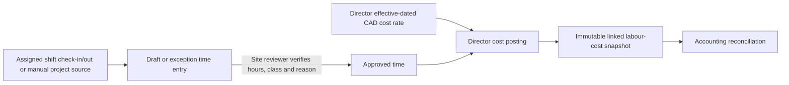

# Approved time, effective rates and labour cost

**Screens:** `/finance/time` for operational review; `/finance/rates` for Director-only cost rates. Supervisors, Operations Managers and granted Area Managers can review site time; only a Director can view/change worker cost rates and post labour cost. This workflow is operational costing, **not payroll approval**.

## Time reviewer procedure

1. On **Approved time and labour**, select the authorized casino. To **Derive from attendance**, choose a persisted shift assignment. Check-in and checkout form the source. A missing check-in/checkout, invalid duration, worker swap or cancelled assignment remains an **exception**, not a guessed cost.
2. For an approved one-off project, use **Manual project time** only with a real site worker, date, project context and source reason. This is not a substitute for unrecorded attendance on a recurring shift.
3. Open **Time review**. Compare the source, actual hours and exception code. Record the approved hours, cost class and required reason; reject or correct unsupported entries. Approval changes the operational time state, but writes **no** labour cost yet.
4. Reload the entry. If the source changes before posting, review the refreshed draft/exception. Do not treat a prior approval as approval of a changed attendance source.

## Director rate and posting procedure

1. In **Worker cost rates**, select worker, regular/overtime/contractor class, CAD hourly cost, effective-from date and optional exclusive end date. Record reference and reason. Check rate history; overlapping active intervals are rejected. A changed rate creates history and does not rewrite a posted historical cost.
2. Return to **Approved time and labour**. Confirm the entry is approved, its site-local work date and cost class, and that exactly one effective rate exists. Select **Post approved cost**.
3. Reload and verify the linked `labor_cost_entries` snapshot. Posting again returns the existing ledger record rather than creating another cost. The rate and cost remain confidential to the Director. The site manager may see operational hours and aggregate accepted labour later, not individual cost rates.
4. Match the cost against an accepted accounting allocation during [reconciliation](ACCOUNTING_AND_CLOSE.md). The older direct labour entry form on `/finance` is a separately labelled **administrative adjustment**, not the normal attendance-derived path.

| Stop condition | Action |
| --- | --- |
| Missing attendance or worker swap | Keep exception until a site reviewer documents actual hours and class. |
| No effective rate or overlapping interval | Director corrects the effective-dated rate history; do not invent a cost. |
| Wrong site/project/date | Correct the unposted operational entry with a reason; posted cost is immutable through this path. |
| Area Manager asks for worker rate | Use approved aggregate site finance only; do not export individual rates or ledger rows. |

The [time actions](../../src/app/finance/time/actions.ts) call site-scoped time RPCs; [rate actions](../../src/app/finance/rates/actions.ts) are Director-only. `time_entries` and their audit events hold operational approval; `worker_cost_rates` and rate events hold effective intervals; the Director-only linked `labor_cost_entries` row captures the historical rate snapshot. See [technical flow](../PROCESS_FLOWS.md#19-approved-time-to-confidential-labour-cost-clean-036) and [Gate A training](../demo/GATE_A_FINANCE_TRAINING.md#c-time-rates-project-and-accounting-close).

**Training check:** create a synthetic missing-checkout exception and show that it has no posted cost. Resolve a separate supported entry, post it as Director, then show that an Area Manager can see approved hours but not the rate.
